# Authentication situations and who is under test

The GUPZ data platform offers use case agnostic FHIR APIs on the PARIS, and
every party that calls them is a client. Which authentication applies, and what
a test looks like, depends entirely on which side is the system under test. This
page maps the situations, so that a test set can be placed in the whole rather
than read as the whole.

The actors, from [PSA.md][psa-soc] and [medmij.md][mm-rol]:

| Actor | Role |
|---|---|
| PARIS | The source system. Sits behind the data platform, out of scope |
| Data platform | Offers the FHIR APIs. This is the interface GUPZ specifies |
| DVA | Dienstverlener Aanbieder, the MedMij role that serves a PGO |
| Verwijsplatform, ZorgDomein | Referral |
| Vecozo dienst Verwijzen | Referral, with its own profile |
| NIS | Netwerk Informatie Systeem |
| PGO | Personal health environment. Talks to a DVA, never to the data platform |

## Two shapes, and one combination

Everything below is one of two shapes. Either Conformancelab makes the call, or
it receives one and plays the part of the other side. That single distinction
decides what a test can assert, and whether stubs are involved at all.

```mermaid
flowchart TB
  subgraph one["Conformancelab is the caller: situations 1, 3, 4, 5"]
    direction LR
    cl1["Conformancelab"] -- "request carrying a token" --> dp1["Data platform<br>system under test"]
    dp1 -. "response, asserted on" .-> cl1
  end
  subgraph two["Conformancelab is the receiver: situation 2"]
    direction LR
    dva["DVA<br>system under test"] -- "request carrying a token" --> cl2["Conformancelab<br>plays the data platform, with stubs"]
    cl2 -. "stubbed response" .-> dva
  end
  subgraph three["Both at once: situation 6"]
    direction LR
    cl3["Conformancelab"] -- "request carrying a token" --> dp3["Data platform<br>system under test"]
    dp3 -- "fetches the key set to verify the signature" --> cl4["Conformancelab<br>hosts the JWKS, with a stub"]
  end
```

Situation 7 is in neither shape: Conformancelab has no part in it.

The consequence worth remembering: a stub can only catch traffic that arrives at
Conformancelab, so stubs exist in the second shape and in the second half of the
third. In the first shape something has to exist at the other end, which is why
those sets need an endpoint rather than a mock.

## The situations

| # | Situation | System under test | What Conformancelab does | Where it is described | Status |
|---|---|---|---|---|---|
| 1 | A DVA queries the data platform | Data platform | **Caller.** Sends the request itself, carrying a supplied token, and asserts on the response | [medmij.md][mm-rol], [pdfa.md][pdfa-sec], [security.md][sec-tok] | Built, 11 cases |
| 2 | The same interface, with the DVA under test | DVA | **Receiver.** Mocks the data platform with stubs, catches the request and asserts on what the DVA sent | same as 1 | Not built |
| 3 | Vecozo sends a referral | Data platform | **Caller.** As 1, with a Vecozo token: signed but not encrypted, no `patient` or `provider`, fixed `iss` | [referral.md][ref-vec] | Not built |
| 4 | ZorgDomein sends a referral | Data platform | **Caller.** As 1, but the security profile is not GUPZ's | [referral.md][ref-zd], external | Not built, profile is external |
| 5 | A NIS queries the data platform | Data platform | **Caller.** As 1 | [PSA.md][psa-soc] | Not built, no separate requirements exist |
| 6 | The platform fetches a JWKS | Data platform | **Caller and receiver.** Sends the request, then hosts the key set as a stub and checks whether the platform retrieves it and picks the key matching the `kid` | [security.md][sec-rot], [#27][i27] | Not built, mechanism unspecified |
| 7 | A PGO retrieves data from a DVA | PGO or DVA | **Not involved.** This is the existing Nictiz MedMij qualification | [medmij.md][mm-rol] | Outside GUPZ, but the source of our PDF/A scripts |

Situation 1 is worked out in [auth-test-design.md](auth-test-design.md).

## Three things this picture makes visible

**There is no authorization server anywhere in GUPZ.** The data platform is a
resource server and nothing else: no `/authorize`, no `/token`. According to
[`security.md`][sec-tok] the calling system creates the token itself, signs it
with its own private key and encrypts it with the platform's public key.
Obtaining a token happens between a PGO, a DVA and the DVA's own authorization
server, all outside this interface. So on the interface GUPZ specifies there is
no authentication *flow* to mock, which is why stubs appear in only two rows
above: situation 2, where the traffic runs towards Conformancelab, and situation
6, the single moment the platform itself calls out.

**Transport sits outside Conformancelab in every row.** mTLS, the TLS version,
the cipher suites and the certificate profile all live in the handshake, and a
TestScript never sees it. Because Conformancelab presents a client certificate
that is configured per instance, any case that succeeds does prove an mTLS
connection was established, but the other half, that a caller without a valid
certificate is refused, cannot be produced from a TestScript. That check has to
happen alongside the scripts.

**Nobody uses the generic profile exactly as written.** MedMij adds `scope`,
Vecozo deviates on five points, ZorgDomein has a profile of its own and for a
NIS nothing is written down at all. What "the GUPZ token" is therefore depends
on who is calling, and no single test set covers the interface: it takes one per
counterparty.

The table above had to be assembled from three documents, which is why
[#74][i74] asks for that overview to live in the specification, together with
the question it raises: is the generic profile a baseline that the others
deviate from, or a fallback for callers without a profile of their own?

That question was answered on 17 August. The direction in [#74][i74] is that
`security.md` holds the token profile for every situation, a NIS included, with
ZorgDomein and Vecozo as the named exceptions, because both already have token
specifications of their own. So it is a baseline. One profile for all callers
was the original intention and has been let go. The overview itself is to be
discussed with the front runners before it is written down.

The same reading shows how one sided the current coverage is. Everything that
exists tests the data platform. The party that produces the token, and so
decides whether anything secure actually happens, is not tested at all today.
That is situation 2, and it is the largest gap in this table.

[psa-soc]: https://github.com/Gegevensuitwisseling-Paramedische-Zorg/open-GUPZ/blob/main/docs/PSA.md#seperation-of-concerns
[mm-rol]: https://github.com/Gegevensuitwisseling-Paramedische-Zorg/open-GUPZ/blob/main/docs/architecture/medmij.md#rol-in-het-medmij-afsprakenstelsel
[pdfa-sec]: https://github.com/Gegevensuitwisseling-Paramedische-Zorg/open-GUPZ/blob/main/docs/api/pdfa.md#security
[sec-tok]: https://github.com/Gegevensuitwisseling-Paramedische-Zorg/open-GUPZ/blob/main/docs/api/security.md#token-beveiliging
[sec-rot]: https://github.com/Gegevensuitwisseling-Paramedische-Zorg/open-GUPZ/blob/main/docs/api/security.md#key-rotation
[ref-vec]: https://github.com/Gegevensuitwisseling-Paramedische-Zorg/open-GUPZ/blob/main/docs/api/referral.md#vecozo-dienst-verwijzen-1
[ref-zd]: https://github.com/Gegevensuitwisseling-Paramedische-Zorg/open-GUPZ/blob/main/docs/api/referral.md#zorgdomein
[i27]: https://github.com/Gegevensuitwisseling-Paramedische-Zorg/open-GUPZ/issues/27
[i74]: https://github.com/Gegevensuitwisseling-Paramedische-Zorg/open-GUPZ/issues/74
